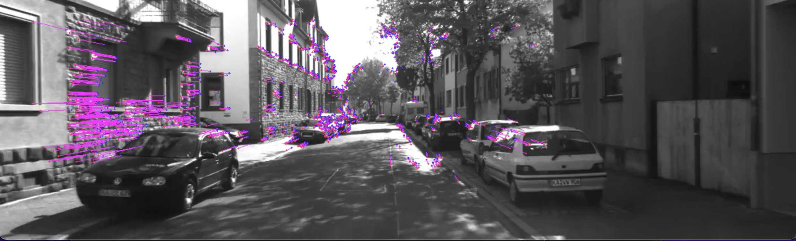
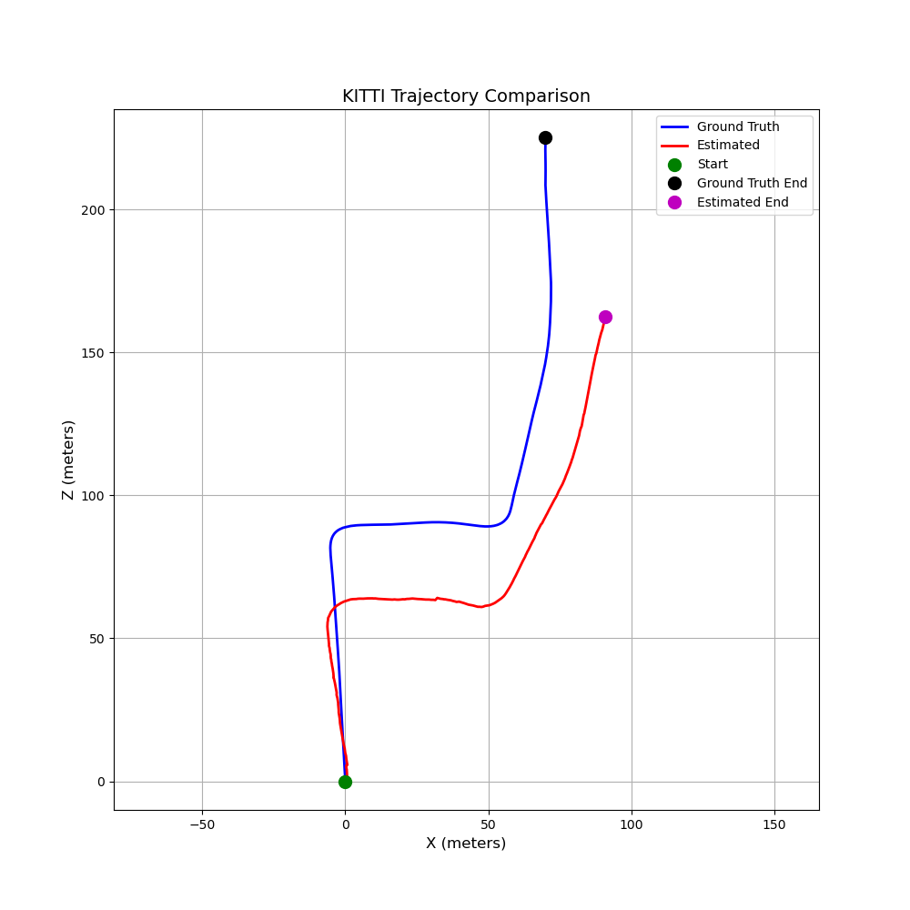

# Monocular-Visual-Odometry

Mein ursprüngliches Ziel war es, SLAM mit einer IMU zu implementieren. Dabei war die Idee, das Ganze an einer realen Hardware auszuprobieren. Daraufhin habe ich begonnen, mir alle möglichen Teile zu bestellen, um mir einen kleinen Roboter auf zwei Rädern zu bauen – also Mikrocontroller, Motoren, Motorsteuerung, Akku, Kabel und natürlich eine Kamera, um schließlich SLAM zu implementieren und auch in der realen Welt zu testen.
Während ich auf die Teile gewartet habe, begann ich mit der Recherche und musste feststellen, dass es sich bei SLAM um einen sehr komplexen Algorithmus handelt, der aus vielen Teilschritten besteht. Aber was ist SLAM überhaupt, und was macht es?

# Introduction

SLAM steht für Simultaneous Localization and Mapping und ist ein Verfahren, um z. B. einen Roboter selbständig seine Umgebung erkunden zu lassen, wobei er sich selbst in dieser Umgebung lokalisieren kann und gleichzeitig eine Karte erstellt.
Es gibt verschiedene Arten der Umsetzung von SLAM, abhängig z. B. von der eingesetzten Technologie:
- LIDAR-SLAM: Hier wird ein LIDAR-Sensor verwendet, um Umgebungsdaten zu erfassen und daraus eine Karte zu erstellen.
- Visual SLAM: Arbeitet mit Kameras. Dabei wird unterschieden zwischen monokularem SLAM (nur mit einer Kamera) und stereo SLAM (mit zwei Kameras).
  --> Der entscheidende Unterschied liegt darin, dass bei monokularem SLAM die Tiefeninformation nicht direkt berechnet werden kann, sondern nur mit einem Skalierungsfaktor geschätzt werden kann. Bei Stereokameras hingegen kann die Tiefeninformation direkt per Disparitätenmessung berechnet werden.
- IMU-gestütztes SLAM: Kombiniert die Sensordaten eines IMU mit den Kamerabildern oder LIDAR und ermöglicht somit eine viel präzisere Erfassung der Position des Roboters.

# Warum Visual Odometry ?

Ein wichtiger Bestandteil von SLAM ist die Visual Odometry (VO). VO ist das sogenannte Frontend in einem SLAM-System. Es schätzt die Bewegung der Kamera nur anhand von Bildinformationen, indem es Feature-Punkte extrahiert, diese zwischen mehreren Frames vergleicht und daraus die Bewegung der Kamera berechnet. Doch dazu gleich mehr ...
SLAM geht jedoch noch einen Schritt weiter: Neben der VO im Frontend gibt es ein Backend, das durch Methoden wie Bundle Adjustment die Positionsschätzung weiter optimiert und durch Loop Closure Fehler reduziert. Da SLAM also im Grunde eine Erweiterung von VO ist, habe ich mich entschieden, mich zuerst auf Visual Odometry zu konzentrieren und diese sauber zu implementieren, bevor ich eine Erweiterung Richtung volles SLAM-System in Betracht ziehe.

# Umsetzung

Zum Thema VO wurde sehr viel Forschung betrieben, da es ein entscheidender Punkt ist, z. B. beim autonomen Fahren von Autos. Dementsprechend gibt es auch hier viele Vorgehensweisen. Zum einen gibt es direkte Methoden, die eine explizite Feature-Extraktion vermeiden und stattdessen direkt die Intensitätswerte der Pixel benutzen, um Bewegungsinformationen zu berechnen (z. B. der SVO-Algorithmus von der Universität Zürich). Dann gibt es Feature-basierte Methoden, die über mehrere Frames markante Bildpunkte verfolgen und dadurch die Bewegung der Kamera bestimmen. Schließlich gibt es noch sogenannte Hybrid-Methoden, die eine Mischung aus beidem anwenden.

# Feature basiertes VO

In dieser Arbeit habe ich mich für eine Feature-basierte Methode entschieden.
Zuerst werden für jeden Frame mit Hilfe von ORB-Features markante Punkte erkannt. Dadurch erhalte ich also meine Keypoints, woraus ich mir gleich auch die Deskriptoren berechne. Dies ist zwingend notwendig, denn mit Hilfe der Deskriptoren kann ich feststellen, ob die erkannten Keypoints vom aktuellen Frame mit den Keypoints aus den vorherigen Frames übereinstimmen.
Dafür ist die matchFeatures() Funktion in der FeatureTracker-Datei da, und mit Hilfe des Lowe's Ratio Tests werden aus den gematchten Features nur die "guten", also die mit dem geringsten Abstand zueinander, herausgesucht.
Aus den guten Matches kann ich mir dann wieder die Indizes der entsprechenden Deskriptoren heraussuchen, um die dazu passenden Keypoints wiederzufinden. Anschließend werden die Attribute dieser Keypoints ausgenutzt, um mir die x, y Positionen dieser Keypoints im Bild zu ermitteln.
Da ich nun alle guten Keypoints aus den vorherigen und dem aktuellen Frame habe, sowie meine Kameramatrix bekannt ist (ich habe alles am KITTI-Datensatz implementiert), kann nun die Essential Matrix berechnet werden. Aber was genau bringt mir die Essential Matrix?
Da ich nun alle guten Keypoints habe aus den vorherigen und dem aktuellen Frame, sowie meine Kameramtrix bekannt ist (ich habe alles am KITTI Datensatz implementiert) kann nun die Essential Matrix berechnet werden. Aber was genau bringt mir die Essential Matrix ?

# Was ist die Essential Matrix?

Mit Hilfe der Essential Matrix kann die epipolare Geometrie (also wie verhalten sich zwei Bilder zueinander) zwischen zwei aufeinanderfolgenden Frames beschrieben werden. Dafür benötigt sie die zuvor beschriebenen x, y Positionen der Keypoints aus beiden Frames und die Kameramatrix (intrinsische Kameraparameter). Falls diese nicht bekannt ist, kann auch die Fundamental Matrix berechnet werden. Zudem werden hier mit RANSAC sogenannte Ausreißer aus den Feature-Matches herausgefiltert, indem es wiederholt zufällige Punktpaare auswählt und die Lösung basierend auf der Anzahl der Inlier validiert. All dies ermöglicht letztendlich die Berechnung der relativen Pose (Rotation und Translation) der Kamera.

# Pose Estimation

Nachdem die Essential Matrix berechnet wurde, kann die relative Pose der Kamera zwischen zwei aufeinanderfolgenden Frames bestimmt werden. Dies geschieht durch die Dekomposition der Essential Matrix, wodurch die Rotation und die Translation extrahiert werden. Diese Werte beschreiben die Bewegung der Kamera vom vorherigen Frame zum aktuellen Frame.

# Triangulation und Skalierung

Um die relative Skalierung der Translation zu schätzen, wird die Triangulation verwendet. Dabei werden die 3D-Punkte im Raum rekonstruiert, indem die korrespondierenden 2D-Punkte aus beiden Frames und die berechnete relative Pose genutzt werden. Die Triangulation liefert 4D-Punkte (homogene Koordinaten), die in 3D-Punkte umgewandelt werden, indem sie durch ihre vierte Komponente geteilt werden.
Die relative Skalierung wird dann durch den Vergleich der 3D-Punktwolken aus dem vorherigen und dem aktuellen Frame berechnet. Dabei werden die Abstände zwischen den Punkten in beiden Wolken verglichen, um die Skalierungsänderung zu bestimmen. Dies ist wichtig, da die Essential Matrix nur die Richtung der Translation, nicht aber deren Skalierung liefert.

# Aktualisierung der Pose

Die berechnete relative Pose (Rotation und Translation) wird verwendet, um die aktuelle Pose der Kamera zu aktualisieren. Die Translation wird mit der geschätzten relativen Skalierung multipliziert, um die korrekte Größe der Bewegung zu erhalten. Anschließend wird die Rotation und die skalierte Translation verwendet, um die aktuelle Pose zu berechnen.
Die absolute Pose der Kamera wird durch die Multiplikation der inversen relativen Pose mit der vorherigen absoluten Pose aktualisiert. Dies ermöglicht es, die Position und Orientierung der Kamera im globalen Koordinatensystem zu verfolgen.

# Zusammenfassung

Die Pose Estimation ist ein zentraler Schritt in der visuellen Odometrie, da sie die Bewegung der Kamera zwischen zwei Frames quantifiziert. Durch die Dekomposition der Essential Matrix, die Triangulation von 3D-Punkten und die Aktualisierung der Pose wird die Position und Orientierung der Kamera kontinuierlich aktualisiert. Dies ermöglicht es, die Trajektorie der Kamera über die Zeit zu verfolgen und so die Bewegung in der Szene zu rekonstruieren.

# Fazit 

Die Implementierung der visuellen Odometrie hat gezeigt, dass die Methode in der Lage ist, die Bewegung der Kamera zwischen aufeinanderfolgenden Frames zu schätzen. Die geschätzte Pose wurde anhand der Ground-Truth-Daten aus dem KITTI-Datensatz evaluiert. Dabei wurde festgestellt, dass die Ergebnisse zwar plausibel sind, jedoch nicht perfekt mit der Ground Truth übereinstimmen. Dies liegt vor allem an der fehlenden absoluten Skalierung, die durch die Essential Matrix nicht direkt bestimmt werden kann. Die relative Skalierung, die durch die Triangulation geschätzt wird, ist zwar ein guter Ansatz, aber nicht immer zuverlässig, insbesondere bei geringen Bewegungen oder wenigen korrespondierenden Punkten.
Um die Genauigkeit der Pose-Schätzung zu verbessern, könnten zusätzliche Sensoren wie ein IMU (Inertial Measurement Unit) oder ein GPS verwendet werden, um die Skalierung und die absolute Position besser zu bestimmen. Auch die Integration von Loop-Closure-Verfahren, wie sie in SLAM-Systemen verwendet werden, könnte helfen, Driftfehler zu reduzieren und die Genauigkeit der Trajektorie zu erhöhen.

# Ausblick

Um aus der implementierten visuellen Odometrie ein vollständiges SLAM-System (Simultaneous Localization and Mapping) zu machen, sind noch einige Schritte notwendig. Zunächst muss eine Karte der Umgebung erstellt werden, die nicht nur die Position der Kamera, sondern auch die 3D-Punkte der Umgebung speichert. Dies erfordert die Integration von Methoden zur Kartenerstellung und -optimierung, wie z.B. Bundle Adjustment. Zudem muss ein Loop-Closure-Mechanismus implementiert werden, um erkannte Orte wiederzuerkennen und die Karte entsprechend anzupassen.
Des Weiteren plane ich, den in der Einleitung erwähnten kleinen Roboter fertigzustellen, um die entwickelten Algorithmen an realer Hardware zu testen. Dies wird es mir ermöglichen, die Leistung der visuellen Odometrie und des zukünftigen SLAM-Systems in einer realen Umgebung zu evaluieren und gegebenenfalls weitere Verbesserungen vorzunehmen. Der Roboter wird mit einer Kamera ausgestattet sein, die die notwendigen Bilddaten liefert, und möglicherweise auch mit zusätzlichen Sensoren, um die Genauigkeit der Pose-Schätzung zu erhöhen.
Insgesamt bietet die Implementierung der visuellen Odometrie eine solide Grundlage für die Entwicklung eines vollständigen SLAM-Systems, und ich freue mich darauf, diese Technologien in der Praxis zu testen und weiterzuentwickeln.

# Quellen

https://medium.com/miko-technical-blog/demystifying-visual-odometry-the-path-to-precise-indoor-robot-navigation-f0c9fe7d00da

https://medium.com/@3502.stkabirdin/introduction-to-visual-odometry-47bcab3aa213

https://rpg.ifi.uzh.ch/docs/ICRA14_Forster.pdf

https://cseweb.ucsd.edu/~mkchandraker/pdf/icra13_monocular.pdf

https://cvg.cit.tum.de/data/datasets/mono-dataset

https://docs.opencv.org/4.x/dc/dc3/tutorial_py_matcher.html

https://docs.opencv.org/3.4/dc/dc3/tutorial_py_matcher.html

https://docs.opencv.org/4.x/d4/d8c/tutorial_py_shi_tomasi.html

https://docs.opencv.org/4.x/d7/d15/group__fundamental.html

https://docs.opencv.org/4.x/da/de9/tutorial_py_epipolar_geometry.html

https://stackoverflow.com/questions/75621526/bad-essential-matrix-with-opencv

https://stackoverflow.com/questions/77522308/understanding-cv2-recoverposes-coordinate-frame-transformations

https://rezaarrazi.medium.com/monocular-visual-odometry-c8673b7d7019

https://docs.opencv.org/4.x/d9/d0c/group__calib3d.html#gad245d60e64d0c1270dbfd0520847bb87

https://docs.opencv.org/4.x/d9/d0c/group__calib3d.html#ga1b2f149ee4b033c4dfe539f87338e243

https://docs.opencv.org/4.x/d9/d0c/group__calib3d.html#ga54a2f5b3f8aeaf6c76d4a31dece85d5d

https://docs.opencv.org/3.4/d0/dbd/group__triangulation.html

https://rezaarrazi.medium.com/monocular-visual-odometry-c8673b7d7019

https://bitbucket.org/castacks/visual_odometry_tutorial/src/master/visual-odometry/pose_evaluation_utils.py

https://github.com/srane96/Visual-Odometry

http://ragibarnab.com/projects/monocular_visual_slam/
